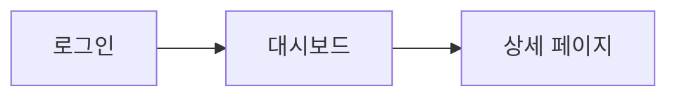

# [서비스명] 화면 설계 - [버전]

> **서비스**: [service-name]
> **버전**: [version]
> **최종 수정**: [YYYY-MM-DD]
> **원본 기획서**: [PPT 파일명 또는 링크]

---

## 변경 이력

| 버전 | 날짜 | 작성자 | 변경 내용 |
|------|------|--------|----------|
| v0.0.1 | YYYY-MM-DD | - | 초기 작성 |

---

## 화면 흐름도

<!-- PM 기획서의 "UI 플로우" / "화면 흐름" 슬라이드에서 추출 -->



---

## 화면 목록

| 화면 ID | 화면명 | URL 패턴 | 관련 기능 | 비고 |
|---------|--------|----------|----------|------|
| S001 | 로그인 | /login | F001 | |
| S002 | 대시보드 | /dashboard | F002, F003 | |

---

## 화면 상세

### S001: [화면명]

- **URL**: /path
- **접근 권한**: (인증 필요 여부, 역할)
- **관련 기능**: F001

#### UI 참조 이미지

<!-- 추출 도구로 assets/ 에 저장된 이미지를 연결 -->
<!-- 이미지가 없으면 이 섹션 삭제 가능 -->

| 이미지 | 설명 |
|--------|------|
|  | 기획서 원본 화면 설계 |

#### 레이아웃 구조

<!-- 위 참조 이미지를 바탕으로 텍스트 와이어프레임 작성 -->

```
┌──────────────────────────────────┐
│           헤더 / 네비게이션         │
├──────────────────────────────────┤
│                                  │
│         메인 컨텐츠 영역            │
│                                  │
├──────────────────────────────────┤
│              푸터                  │
└──────────────────────────────────┘
```

#### UI 컴포넌트

| 컴포넌트 | 유형 | 설명 | 필수 여부 | 유효성 검사 |
|---------|------|------|---------|-----------|
| 사용자명 입력 | TextInput | 이메일 형식 | 필수 | 이메일 형식 검증 |
| 비밀번호 입력 | PasswordInput | 마스킹 처리 | 필수 | 최소 8자 |
| 로그인 버튼 | Button | Primary 스타일 | - | - |

#### 상태 관리

| 상태 | 조건 | UI 표현 |
|------|------|--------|
| 초기 | 페이지 로드 시 | 빈 폼 |
| 로딩 | API 호출 중 | 버튼 비활성화 + 스피너 |
| 성공 | 로그인 성공 | S002로 이동 |
| 에러 | 인증 실패 | 에러 메시지 표시 |

#### 인터랙션

1. 사용자가 이메일/비밀번호 입력
2. 로그인 버튼 클릭
3. API 호출 (POST /api/auth/login)
4. 성공 시 → S002 대시보드로 이동
5. 실패 시 → 에러 메시지 표시

---

### S002: [화면명]

(위와 동일한 구조 반복)

---

## 공통 컴포넌트

<!-- 여러 화면에서 공유하는 UI 요소 -->

| 컴포넌트명 | 사용 화면 | 설명 |
|-----------|---------|------|
| Header | 전체 | 네비게이션, 사용자 정보 |
| Toast | 전체 | 알림 메시지 |

---

## 반응형 / 접근성 요구사항

| 항목 | 요구사항 |
|------|---------|
| 모바일 대응 | (최소 지원 너비) |
| 접근성 | (WCAG 수준, 키보드 네비게이션 등) |
