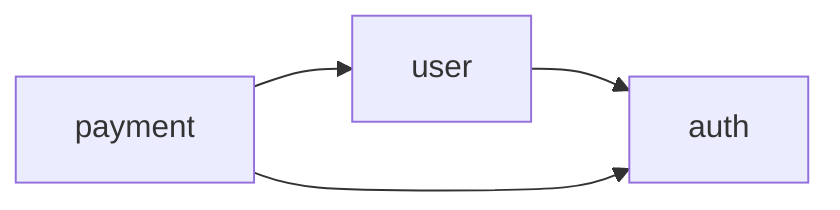

# [서비스명] API 계약서 - [버전]

> **서비스**: [service-name]
> **버전**: [version]
> **최종 수정**: [YYYY-MM-DD]
> **상태**: `Draft` | `Review` | `Locked`

---

## 변경 이력

| 버전 | 날짜 | 작성자 | 변경 내용 | 승인자 |
|------|------|--------|----------|--------|
| v0.0.1 | YYYY-MM-DD | - | 초기 작성 | - |

---

## 이 문서의 목적

이 문서는 **구현 시작 전에 팀이 합의하는 인터페이스 계약**이다.
`05-api-spec.md`가 상세 스펙이라면, 이 문서는 "무엇을 만들기로 했는지"의 합의서 역할을 한다.

### 상태 규칙

| 상태 | 의미 | 허용 행동 |
|------|------|----------|
| **Draft** | 초안 작성 중 | 자유롭게 수정 가능 |
| **Review** | 팀 리뷰 진행 중 | 리뷰 코멘트 반영만 허용 |
| **Locked** | 합의 완료, 구현 시작 가능 | 팀 합의 없이 변경 금지 |

> **Locked 후 변경이 필요하면**: 변경 사유를 문서화하고, 영향받는 도메인 담당자 전원이 확인한 뒤 변경한다.

---

## 도메인 맵

이 서비스의 도메인 분류와 담당 배정.

| 도메인 | 범위 | 담당 | 의존 도메인 | 관련 기능 |
|--------|------|------|------------|----------|
| auth | 회원가입, 로그인, 토큰 관리 | (담당자) | - | F001, F002 |
| user | 프로필 조회/수정 | (담당자) | auth | F003, F004 |
| (도메인) | (범위 설명) | (담당자) | (의존) | (F-ID) |

---

## 공유 타입 정의

모든 도메인이 공통으로 사용하는 타입. **구현 시 이 정의를 따른다.**

### 공통 응답 래퍼

```typescript
// 성공 응답
interface ApiResponse<T> {
  data: T;
  pagination?: Pagination;
}

// 에러 응답
interface ApiError {
  error: {
    code: string;
    message: string;
    details?: Record<string, unknown>;
  };
}

interface Pagination {
  page: number;
  limit: number;
  total: number;
  totalPages: number;
}
```

### 공통 에러 코드

| HTTP 상태 | 에러 코드 | 설명 | 사용 조건 |
|-----------|---------|------|----------|
| 400 | VALIDATION_ERROR | 요청 파라미터 유효성 실패 | 형식, 길이, 범위 위반 |
| 401 | UNAUTHORIZED | 인증 토큰 없음/만료 | 토큰 미제공 또는 만료 |
| 403 | FORBIDDEN | 권한 없음 | 역할/권한 부족 |
| 404 | NOT_FOUND | 리소스 없음 | ID로 조회 실패 |
| 409 | CONFLICT | 리소스 충돌 | 중복 생성, 동시 수정 |
| 429 | RATE_LIMITED | 요청 횟수 초과 | Rate limit 도달 |
| 500 | INTERNAL_ERROR | 서버 내부 오류 | 예상치 못한 서버 에러 |

### 인증 방식

| 방식 | 헤더 | 토큰 형식 | 만료 |
|------|------|----------|------|
| Access Token | `Authorization: Bearer {token}` | JWT | (시간) |
| Refresh Token | Request Body | Opaque | (시간) |

---

## 도메인별 인터페이스 계약

### auth 도메인

#### POST /api/v1/auth/login

- **기능 ID**: F001
- **담당**: (담당자)

**Request:**

```typescript
interface LoginRequest {
  email: string;    // required, email format
  password: string; // required, min 8 chars
}
```

**Response (성공):**

```typescript
interface LoginResponse {
  accessToken: string;
  refreshToken: string;
  expiresIn: number;
  user: UserSummary;
}

interface UserSummary {
  id: string;
  email: string;
  name: string;
  role: "admin" | "user" | "viewer";
}
```

**에러:**

| HTTP | 코드 | 조건 |
|------|------|------|
| 401 | INVALID_CREDENTIALS | 이메일/비밀번호 불일치 |
| 422 | VALIDATION_ERROR | 입력값 형식 오류 |
| 429 | RATE_LIMITED | 5회 연속 실패 |

---

#### (다음 엔드포인트)

(위와 동일한 구조 반복)

---

### (다음 도메인)

(위와 동일한 구조 반복)

---

## 도메인 간 의존 규칙

도메인 간 호출 시 지켜야 할 규칙.

### 허용된 의존 방향



### 의존 규칙

| 규칙 | 설명 |
|------|------|
| **단방향 의존만 허용** | A→B이면 B→A 금지. 순환 의존 발생 시 이벤트/메시지로 분리 |
| **인터페이스를 통한 접근** | 다른 도메인의 내부 구현을 직접 참조하지 않는다 |
| **공유 타입만 사용** | 도메인 간 데이터 전달은 이 문서에 정의된 공유 타입만 사용 |

---

## 합의 체크리스트

계약서를 Locked 상태로 전환하기 전에 확인:

- [ ] 모든 도메인에 담당자가 배정됨
- [ ] 공유 타입 정의가 모든 도메인 담당자에게 공유됨
- [ ] 각 엔드포인트의 Request/Response 타입이 구체적으로 정의됨
- [ ] 에러 코드가 통일된 체계를 따름
- [ ] 도메인 간 의존 방향이 명시되고 순환이 없음
- [ ] 인증/인가 방식이 합의됨
- [ ] 페이지네이션, 정렬, 필터링 규칙이 통일됨
- [ ] 각 담당자가 자기 도메인의 계약 내용을 확인함 (서명/코멘트)

---

## 변경 요청 (Locked 상태에서)

Locked 이후 변경이 필요하면 아래 형식으로 기록한다.

### CR-001: [변경 제목]

- **요청자**: (이름)
- **날짜**: YYYY-MM-DD
- **영향 도메인**: auth, user
- **변경 내용**: (상세)
- **변경 사유**: (왜 필요한지)
- **영향 분석**: (변경 시 어떤 코드/문서가 영향받는지)
- **승인**: (영향 도메인 담당자 전원 확인)
  - [ ] auth 담당: (이름)
  - [ ] user 담당: (이름)
