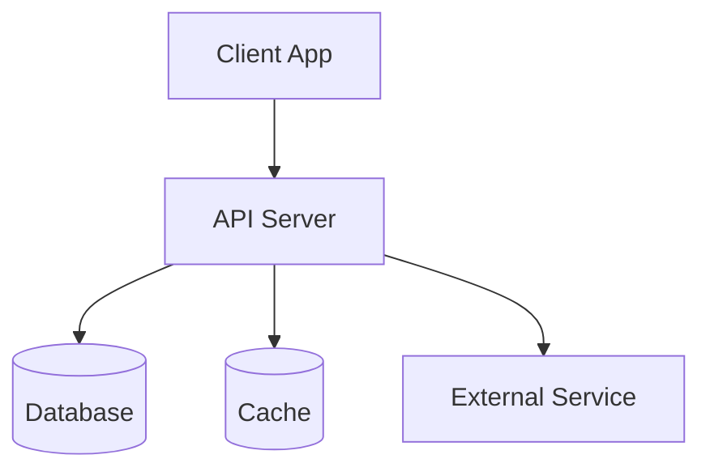

# [서비스명] 구현 가이드 - [버전]

> **서비스**: [service-name]
> **버전**: [version]
> **기술 스택**: [주요 기술 나열]
> **최종 수정**: [YYYY-MM-DD]

---

## 변경 이력

| 버전 | 날짜 | 작성자 | 변경 내용 |
|------|------|--------|----------|
| v0.0.1 | YYYY-MM-DD | - | 초기 작성 |

---

## 아키텍처 개요

### 시스템 구성

<!-- PM 기획서의 "시스템 구성도" 또는 개발자 논의에서 도출 -->



### 기술 스택

| 레이어 | 기술 | 버전 | 비고 |
|--------|------|------|------|
| Backend | FastAPI | 0.100+ | |
| Database | PostgreSQL | 15+ | |
| Cache | Redis | 7+ | |
| Auth | JWT | - | |

### 레이어 구조

```
apps/{service}/
├── src/
│   ├── api/              # API 라우터 (엔드포인트 정의)
│   │   └── v1/
│   ├── core/             # 설정, 보안, 의존성
│   ├── domain/           # 비즈니스 로직 (서비스 레이어)
│   ├── infrastructure/   # 외부 연동 (DB, 캐시, API)
│   │   ├── db/
│   │   └── external/
│   └── models/           # 데이터 모델 (스키마, DTO)
├── tests/
│   ├── unit/
│   ├── integration/
│   └── e2e/
└── pyproject.toml
```

---

## 코딩 컨벤션

### 네이밍 규칙

| 대상 | 규칙 | 예시 |
|------|------|------|
| 파일명 | snake_case | `user_service.py` |
| 클래스 | PascalCase | `UserService` |
| 함수/메서드 | snake_case | `get_user_by_id()` |
| 상수 | UPPER_SNAKE | `MAX_RETRY_COUNT` |
| API 경로 | kebab-case | `/api/user-profiles` |

### 에러 처리 패턴

```python
# 도메인 예외 정의
class DomainError(Exception):
    def __init__(self, code: str, message: str):
        self.code = code
        self.message = message

# API 레이어에서 캐치
@app.exception_handler(DomainError)
async def domain_error_handler(request, exc):
    return JSONResponse(
        status_code=400,
        content={"error": {"code": exc.code, "message": exc.message}}
    )
```

### 로깅 패턴

```python
import structlog
logger = structlog.get_logger()

logger.info("user_login", user_id=user.id, method="password")
logger.error("login_failed", email=email, reason="invalid_password")
```

---

## 기능별 구현 노트

<!-- 각 기능의 구현 세부사항. 바이브 코딩 시 AI가 가장 많이 참조하는 섹션 -->

### F001: [기능명]

- **구현 위치**: `apps/{service}/src/domain/auth/`
- **담당 클래스/함수**: `AuthService.login()`
- **핵심 로직**:
  1. 이메일로 사용자 조회
  2. 비밀번호 해시 비교
  3. JWT 토큰 생성
  4. Refresh 토큰 저장
- **주의사항**:
  - 비밀번호 비교는 constant-time comparison 사용
  - 실패 횟수 5회 초과 시 계정 잠금
- **참조 문서**:
  - 요구사항: `01-requirements.md` > F001
  - API 스펙: `05-api-spec.md` > POST /api/auth/login
  - 테스트: `09-test-cases.md` > TC-F001-*

### F002: [기능명]

(위와 동일한 구조 반복)

---

## 데이터베이스

### 마이그레이션 규칙

- 마이그레이션 도구: Alembic
- 명명 규칙: `{timestamp}_{description}.py`
- 롤백 가능한 마이그레이션만 허용

### 주요 테이블

```sql
-- users 테이블
CREATE TABLE users (
    id UUID PRIMARY KEY DEFAULT gen_random_uuid(),
    email VARCHAR(255) UNIQUE NOT NULL,
    password_hash VARCHAR(255) NOT NULL,
    name VARCHAR(100) NOT NULL,
    role VARCHAR(20) NOT NULL DEFAULT 'user',
    created_at TIMESTAMP DEFAULT NOW(),
    updated_at TIMESTAMP DEFAULT NOW()
);
```

---

## 외부 연동

<!-- 외부 서비스/API 연동 정보 -->

| 서비스 | 용도 | 환경변수 | 문서 |
|--------|------|---------|------|
| | | | |

---

## 배포 및 환경

### 환경 변수

| 변수명 | 설명 | 기본값 | 필수 |
|--------|------|--------|------|
| DATABASE_URL | DB 접속 URL | - | Yes |
| JWT_SECRET | JWT 서명 키 | - | Yes |
| REDIS_URL | Redis 접속 URL | localhost:6379 | No |

### 환경별 설정

| 항목 | 개발 | 스테이징 | 운영 |
|------|------|---------|------|
| 디버그 모드 | ON | OFF | OFF |
| 로그 레벨 | DEBUG | INFO | WARNING |
