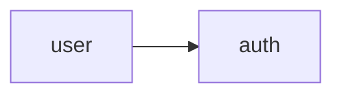

# [서비스명] Context

> 이 파일은 AI 에이전트가 서비스 작업을 시작할 때 **가장 먼저 읽는 진입점**입니다.
> 서비스의 현재 상태와 문서 위치를 요약합니다.

---

## 서비스 개요

**[서비스명]**은 (서비스가 하는 일을 한 문단으로 요약)

- **서비스 코드명**: [service-name]
- **현재 작업 버전**: v0.0.1
- **기술 스택**: [예: Python 3.12, FastAPI, PostgreSQL / Go 1.25, Wails v2.11 / React 19, TypeScript 5.9, Vite 7]
- **담당**: [팀/담당자]

---

## 도메인 배정

> API 계약서(`03-api-contract.md`)가 Locked 상태일 때 아래 배정을 기준으로 작업한다.

| 도메인 | 범위 | 담당 | 상태 | 관련 기능 |
|--------|------|------|------|----------|
| auth | 회원가입, 로그인, 토큰 | (담당자) | 대기 | F001, F002 |
| user | 프로필, 설정 | (담당자) | 대기 | F003, F004 |
| (도메인) | (범위) | (담당자) | (상태) | (F-ID) |

**상태 값**: `대기` → `진행중` → `리뷰중` → `완료`

### 도메인 간 의존 관계



> 의존 방향은 `03-api-contract.md`에 정의된 규칙을 따른다.

---

## 문서 가이드

현재 버전(`v0.0.1`)의 개발 문서:

| 문서 | 경로 | 용도 |
|------|------|------|
| 요구사항 | `docs/{service}/v0.0.1/01-requirements.md` | 기능 목록, 비즈니스 규칙 |
| 화면설계 | `docs/{service}/v0.0.1/02-screen-spec.md` | UI 구조, 컴포넌트, 상태 |
| **API 계약서** | `docs/{service}/v0.0.1/03-api-contract.md` | **팀 합의된 인터페이스 계약** |
| API 스펙 | `docs/{service}/v0.0.1/05-api-spec.md` | 엔드포인트 상세, 요청/응답 |
| 구현 가이드 | `docs/{service}/v0.0.1/08-implementation-guide.md` | 아키텍처, 패턴, 구현 노트 |
| 테스트 케이스 | `docs/{service}/v0.0.1/09-test-cases.md` | 테스트 시나리오, 기대 결과 |

---

## 현재 진행 상황

### v0.0.1 기능 진행률

- [ ] F001: [기능명] - (상태: 대기/진행중/완료)
- [ ] F002: [기능명] - (상태)
- [ ] F003: [기능명] - (상태)

### 최근 변경 사항

| 날짜 | 변경 내용 | 관련 기능 |
|------|----------|----------|
| YYYY-MM-DD | (변경 내용 요약) | F001 |

---

## 소스코드 위치

```
apps/{service}/
├── src/          # 메인 소스코드
├── tests/        # 테스트 코드
└── ...
```

---

## 의존 서비스

| 서비스 | 관계 | 설명 |
|--------|------|------|
| (없으면 "독립 서비스" 명시) | | |

---

## 작업 시 주의사항

<!-- 이 서비스 작업 시 AI가 반드시 인지해야 할 사항 -->

- (주의사항 1)
- (주의사항 2)
