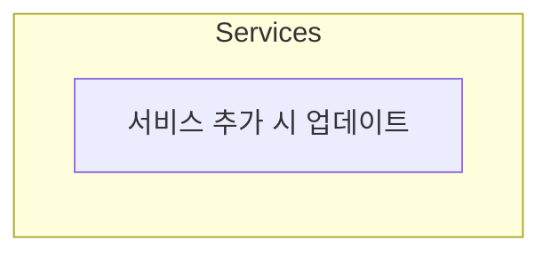
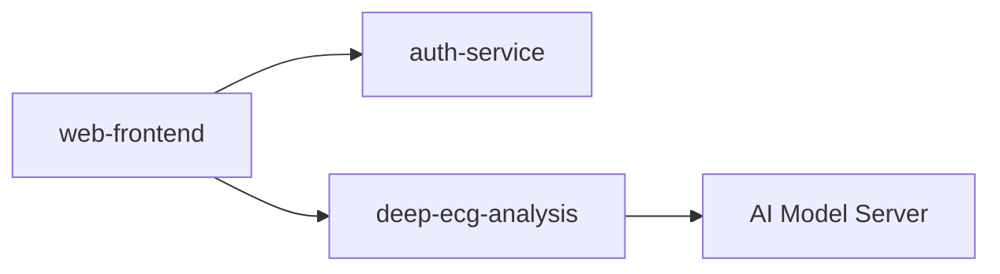

# 프로젝트 서비스 맵

> 이 프로젝트에서 관리하는 모든 서비스의 현황과 문서 위치를 안내합니다.
> AI 에이전트는 작업 전 이 문서를 참고하여 대상 서비스를 식별합니다.

---

## 서비스 현황

<!-- 서비스가 추가될 때마다 이 테이블을 업데이트합니다 -->

| 서비스명 | 현재 버전 | 기술 스택 | 상태 | CONTEXT.md |
|---------|----------|----------|------|-----------|
| (아직 등록된 서비스 없음) | - | - | - | - |

<!--
예시:
| deep-ecg-analysis | v0.0.2 | Python 3.12, FastAPI, PostgreSQL | 개발중 | docs/deep-ecg-analysis/CONTEXT.md |
| auth-service | v0.0.1 | Python 3.12, FastAPI, Celery | 개발중 | docs/auth-service/CONTEXT.md |
| desktop-app | v0.0.1 | Go 1.25, Wails v2.11 | 개발중 | docs/desktop-app/CONTEXT.md |
| web-frontend | v0.0.1 | React 19, TypeScript 5.9, Vite 7 | 기획중 | docs/web-frontend/CONTEXT.md |
-->

---

## 서비스 관계도

<!-- 서비스 간 의존 관계가 생기면 아래 다이어그램을 업데이트합니다 -->



<!--
예시:

-->

---

## 문서 구조 안내

각 서비스는 다음 구조로 문서를 관리합니다:

```
docs/{service-name}/
├── CONTEXT.md              ← AI 진입점 (도메인 배정, 문서 위치)
└── {version}/
    ├── assets/             ← PPT/PDF에서 추출한 UI 이미지
    ├── 01-requirements.md  ← 기능 목록, 비즈니스 규칙
    ├── 02-screen-spec.md   ← UI 구조, 컴포넌트, 상태
    ├── 03-api-contract.md  ← 팀 합의 인터페이스 계약 (Draft→Review→Locked)
    ├── 05-api-spec.md      ← API 엔드포인트 상세, 요청/응답
    ├── 08-implementation-guide.md ← 아키텍처, 패턴, 구현 노트
    └── 09-test-cases.md    ← 테스트 시나리오, 기대 결과
```

### 문서 번호의 의미

번호 사이에 빈 번호가 있는 것은 향후 문서 유형 추가를 위한 여유 공간입니다:

- 01~04: 기획/설계 영역 (요구사항, 화면설계, API 계약서, ...)
- 05~07: 인터페이스 영역 (API 스펙 상세, ...)
- 08~09: 구현/검증 영역 (구현 가이드, 테스트 케이스)

---

## 빠른 시작: 새 서비스 추가

1. `docs/{service-name}/` 폴더 생성
2. `docs/_templates/CONTEXT.md`를 복사하여 `docs/{service-name}/CONTEXT.md` 작성
3. `docs/{service-name}/{version}/` 폴더 생성 (`assets/` 폴더 포함)
4. `docs/_templates/`의 **6개 템플릿**(01, 02, 03, 05, 08, 09)을 복사하여 작성
5. `.cursor/rules/service-example-rules.mdc`를 복사하여 `{service}-rules.mdc` 작성
6. 이 문서의 "서비스 현황" 테이블에 추가

> `03-api-contract.md`는 **Draft** 상태로 생성하고, 팀 리뷰 후 **Locked** 전환 뒤 구현을 시작합니다.

---

## 빠른 시작: PM 기획서 PPT 변환

1. `tools/extract-doc.py`로 PPT에서 텍스트 + 이미지 추출
   ```bash
   pip install -r tools/requirements.txt
   python tools/extract-doc.py input.pptx --output docs/{service}/{version}/
   ```
2. 추출된 텍스트를 AI에게 전달하며 요청:
   "이 기획서를 `@docs/_templates/` 템플릿 기반으로 `docs/{service}/{version}/`에 개발 문서로 변환해줘"
3. 생성된 **6개 문서**를 검토 (03-api-contract.md는 Draft 상태로 생성됨)
4. `CONTEXT.md` 업데이트 (도메인 배정 포함)
5. 이 문서의 "서비스 현황" 테이블 업데이트
6. 팀이 `03-api-contract.md`를 리뷰 → **Locked** 전환 → 구현 시작
